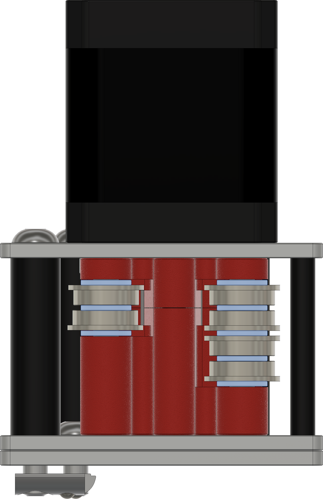
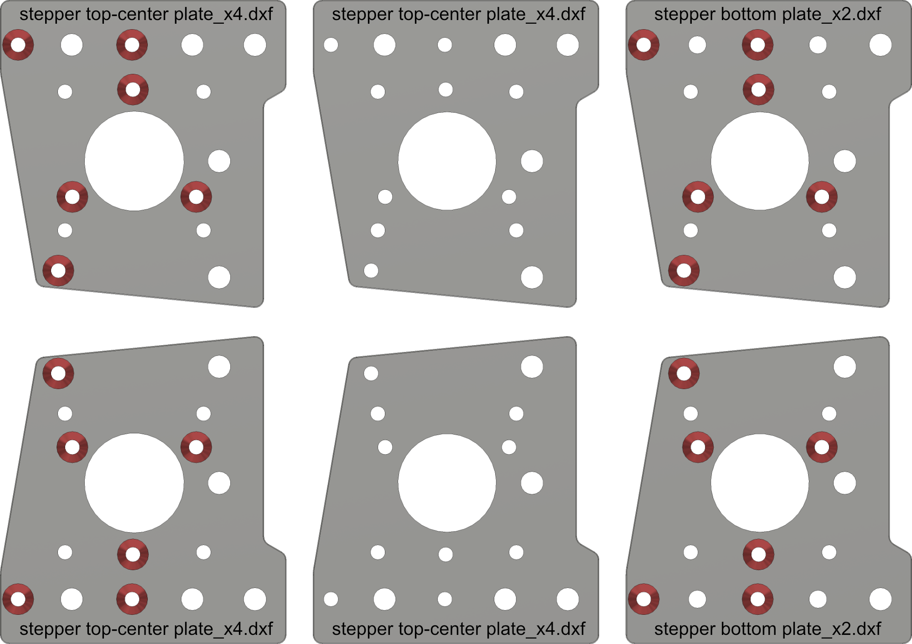

# Mercury One.1 - Full Metal Gantry

## 6mm Metric Stepper Mount Files

These are the files for 6mm belts using Metric 3mm (.118in)  If your plates are 1/8in thick plates (.125in or 3.175mm) then please use the Imperial files.

## Offset Files

The offset files have an extra 0.2mm added to the bottom faces. This is due to some printers loosing up to 1 layer height in the start of the prints. First print the standard files, and measure the stack height for the left and right sets. They should add up to 34.81mm to 35mm. If they come in 0.2mm short, you can reprint either the tops or bottoms. And if they are 0.4mm short, then print all of the files needed from the offset files. (A gap of 0.2mm to 0.4mm is also mainly just cosmetic, so you can also skip reprinting if the gap does not bother you.)

## Double Shear Bearing Support Files

5mm shafts without being supported on the other end of the pulley, limit your belt tension to around 110hz. Going past this could bend your stepper shafts. I have included files to support a handful of bearings for a double shear setup. You will need stepper motors with longer stepper shafts than normal, 40 or longer. See the chart bellow for supported bearings.

### Motor and Bearing supports

- Kraken motors (40x5mm Shafts) should work with 625-2RS (5x16x5mm) and 635-RS (5x19x6mm) bearings.
- 55x5mm Shafts will work with 625-RS (5x16x5mm) and 635-2RS (5x19x6mm) bearings.
- 55x8mm Shafts will work with 698-RS (8x19x6mm) and F608-2RS (8x22x7mm) bearings.

### Bearing Notes

- F in front of a bearing name denotes that it is a flanged bearing
- 2RS on the end of a bearing part number means it has 2 Rubber Seals
- RS calls for one rubber seal, and one open side. Though often stores like Amazon will list their 2RS bearings using just RS.
- ZZ on the end of a bearing part number means it uses 2 metal shields in place of seals.
- You will most likely need to sand the ends of your stepper shafts to fit the bearing bores.
- F608-2RS note: I recommend using green bearing retaining compound on the outside fo the bearing, as the 22mm holes in the laser cut plates are not a press fit.

___

Flange stacks are same as the stock Mercury one.1, all shims are M5x1 and placed as shown in the image below.

Countersink the holes marked in red. Marking them in advanced with a sharpie can help prevent countersinking the wrong holes. You only need to countersink 4 of the 6 plates.

___

## DXF Plate BOM

| Part Description                       | Quantity |
|----------------------------------------|----------|
| Stepper Top-Center Plate_x4.dxf        | 4        |
| Stepper Bottom Plate_x2.dxf            | 2        |

## 6mm Metric Stepper Mount Hardware BOM

| Part Description               | Quantity |
|--------------------------------|----------|
| M3x30 standoffs                | 8        |
| M5x30 Spacer (8 or 10mm OD)    | 4        |
| 5x40mm Dowel Pins              | 4        |
| *F695RS Bearing                | 12       |
| *6mm 20t 5mm Bore GT2 Pulley   | 2        |
| M3x10 FHCS                     | 12       |
| M3x12 FHCS                     | 12       |
| M5x12 BHCS                     | 2        |
| M5x50 BHCS                     | 4        |
| M3x4x5mm Heatsets (5mm OD)     | 12       |
| M5x1 Shim                      | 22       |
| **M5x0.1 Shim                  | 8        |

*Included in default Mercury One.1 BOM

**Optional parts
