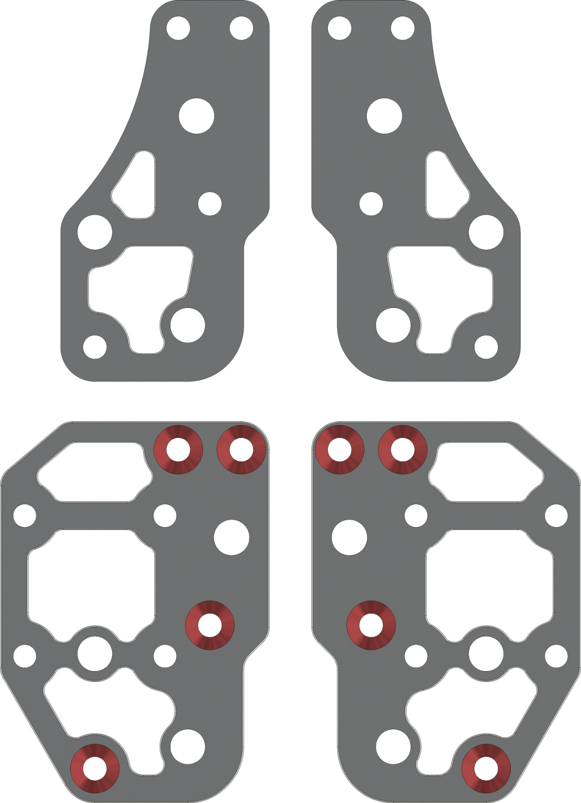

# 6mm Metric Xjoints

___

**Top Mount Xjoints** are for toolheads designed around the stock Zerog Mercury one.1 belt path. (Zerog EVA 2.4, E34M1, VZCNC Zerog)

**Front Mount** for any toolhead made for a front mounted MGN12 rail. (Voron Stealth Burner, XOL, Archtype, ect.)

**Toothed idlers:** Cad is currently only designed around Gates pulleys, other pulleys are not as tall and will require more shims. I will add more printed inserts and recommended shim stacks for other idlers later.
___

**Tools Needed:**

- Drill press
- 90 degree Countersinking bit (82 degree also works)
- 220 grit sandpaper (For sanding dowel pins to fit into the bearings)
- Cordless drill (Use with a spare dowel pin to ream the dowel pin holes to size as needed)
- Blue medium strength thread locker

___

Bearing flange stacks and Idler spacer image

- Flange stacks use 0.5mm on the outside, and a 1.0mm in the center.
- Gates Idler's use 0.3mm on either side. Other pulleys might also need a 0.5mm on either side.

Countersink the holes marked in red. Marking them in advanced with a sharpie can help prevent countersinking the wrong holes.

___

## DXF Plate BOM

| Part Description                       | Quantity |
|----------------------------------------|----------|
| Xjoint Bottom_x2.dxf                   | 2        |
| Xjoint Top_x2.dxf                      | 2        |

## 6mm Metric Xjoint Hardware BOM

| Part Description               | Quantity |
|--------------------------------|----------|
| M3x20 standoffs                | 8        |
| 5x26mm Dowel Pins (Or 5x25)    | 4        |
| *6mm 20t 5mm Bore GT2 Idler    | 2        |
| *F695RS Bearing                | 4        |
| M3x6 FHCS                      | 8        |
| M3x10 FHCS                     | 16       |
| M5x8 BHCS                      | 4        |
| M5x1 Shim                      | 2       |
| M5x0.5 Shim                    | 4       |
| M5x0.3 Shim                    | 4       |
| **M5x0.1 Shim                  | 4       |

*Included in default Mercury One.1 BOM

**Optional parts
