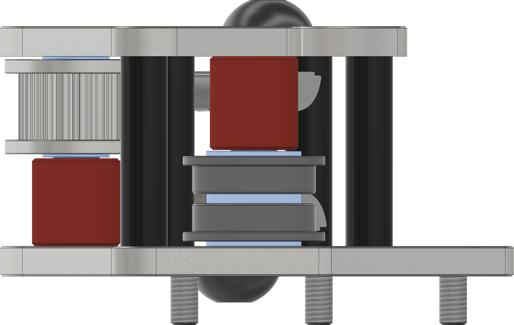
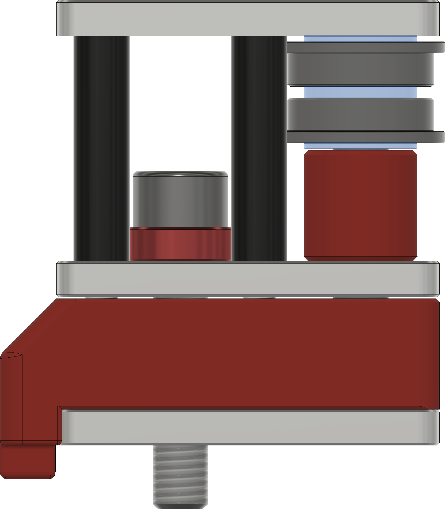
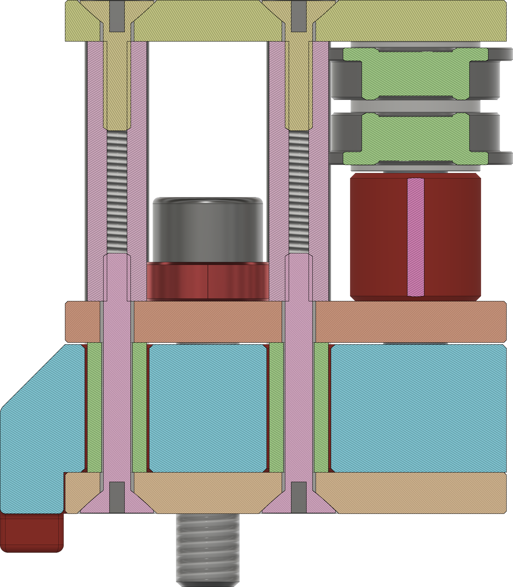

# 6mm Full Metal Gantry

___

Stepper Flange Stack assembly:
5x1mm shims as shown in the image below.

M3 washers might be needed with the stepper screws to prevent them from bottoming out in the threads.

Metric plates (3mm thick plates) will require M5x1 shims under the M5 bolts to prevent the threads from bottoming out against the extrusion

  
  
___

## 6mm Xjoints

For the flange stack use 2x M5x0.5 shims and 1x M5x1 shim. You can tighten up the fit with M5x0.1mm shims.

For Gates 20T Idlers use M5x0.3mm shims on either side of the idler. You can tighten up the fit with M5x0.1mm shims.

___

## 6mm Front Towers

For the flange stack use 2x M5x0.5 shims and 1x M5x1 shim. You can tighten up the fit with M5x0.1mm shims.

The M5 bolt needs a M5x3(Imperial) or M5x4(Metric) spacer under the bolt head, shims or washers can also be used in place of a single spacer.

Make sure to press in the 4 M3x10 smooth spacers inside the printed insert. These should be as tall or taller than the print itself. If your print is taller, file or sand the top of it until the inserts are flush or slightly taller thant the print.

___

### 6mm Hardware BOM

| Part Description               | Quantity |
|--------------------------------|----------|
| M3x20 standoffs                | 16       |
| M3x35 standoffs                | 6        |
| M3x5x10 spacers                | 8        |
| M5x35 Spacers                  | 4        |
| M5x3 Spacers (Imperial)        | 2        |
| M5x4 Spacers (Metric)          | 2        |
| 5x26mm Dowel Pins (Or 5x25)    | 4        |
| *5x30mm Dowel Pins             | 2        |
| 5x40mm Dowel Pins              | 4        |
| *6mm 20t 5mm Bore GT2 Pulley   | 2        |
| *6mm 20t 5mm Bore GT2 Idler    | 2        |
| *F695RS Bearing                | 20       |
| M3x6 FHCS                      | 8        |
| M3x10 FHCS                     | 36       |
| M3x12 FHCS                     | 14       |
| M3x20 FHCS                     | 8        |
| M5x8 BHCS                      | 4        |
| M5x12 BHCS                     | 3        |
| M5x25 SHCS/BHCS                | 2        |
| M5x50 BHCS                     | 5        |
| M3x4x5mm Heatsets (5mm OD)     | 14       |
| M5x1 Shim                      | 20       |
| M5x0.5 Shim                    | 10       |
| M5x0.3 Shim                    | 10       |
| **M5x0.1 Shim                  | 10       |

*Included in default Mercury One.1 BOM

**Optional parts

### DXF Laser Cut Plates BOM

| Part Description                       | Quantity |
|----------------------------------------|----------|
| Stepper Top-Center Plate_x4.dxf        | 4        |
| Stepper Bottom Plate_x2.dxf            | 2        |
| Xjoint Bottom_x2.dxf                   | 2        |
| Xjoint Top_x2.dxf                      | 2        |
| Front Idler Towers_x6.dxf              | 6        |

### Printed Parts BOM

| Part Description                        | Quantity |
|-----------------------------------------|----------|
| 6mm - Printed Bottom Left Insert.stl    | 1        |
| 6mm - Printed Bottom Right Insert.stl   | 1        |
| 6mm - Printed Top Left Insert.stl       | 1        |
| 6mm - Printed Top Right Insert.stl      | 1        |
| 6mm Gates Toothed Idler Spacer_x2.stl   | 2        |
| 6mm Flange Stack Spacer_x2.stl          | 2        |
| 6mm Front Tower Spacer_x2.stl           | 2        |
| Front Tower Heatset Spacer_x2.stl       | 2        |
