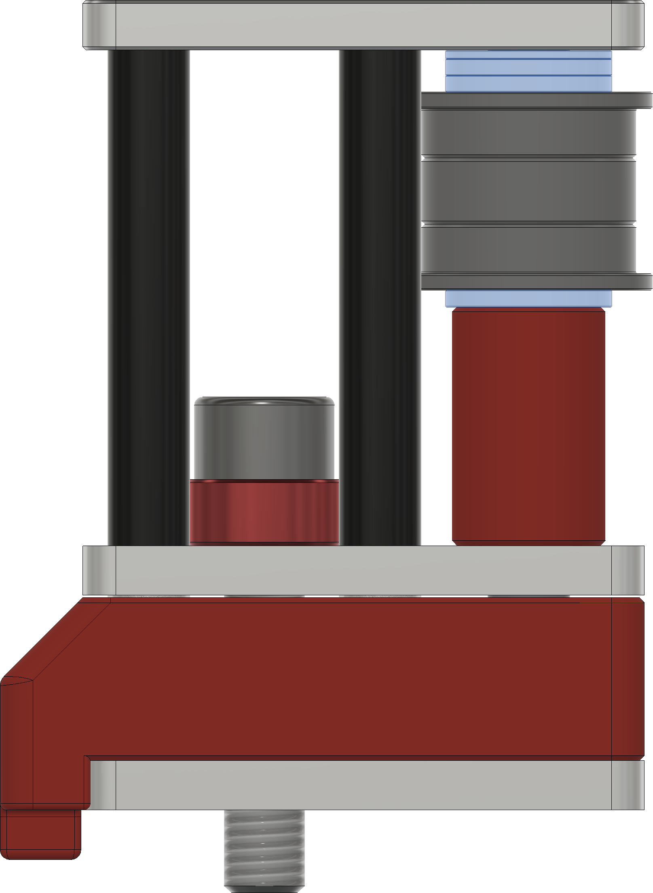

# 9mm Imperial Front Idler Towers

___

**Tools Needed:**

- Drill press
- 90 degree Countersinking bit (82 degree also works)
- 220 grit sandpaper (For sanding dowel pins to fit into the bearings)
- Cordless drill (Use with a spare dowel pin to ream the dowel pin holes to size as needed)
- Blue medium strength thread locker

___

Bearing flange stacks and Idler spacer image

- Flange stacks use 2x M5x1 shims and 1x M5x0.5mm shim on the plate side, and a single M5x1mm shim on the side with the printed spacer.

Countersink the holes marked in red. Marking them in advanced with a sharpie can help prevent countersinking the wrong holes. You only need to countersink 4 of the 6 plates.

___

## DXF Plate BOM

| Part Description                       | Quantity |
|----------------------------------------|----------|
| Front Idler Towers_x6.dxf              | 6        |

## 9mm Imperial Front Idler Hardware BOM

| Part Description               | Quantity |
|--------------------------------|----------|
| M3x30 standoffs                | 8        |
| M3x5x10 spacers                | 8        |
| M5x3 Spacer (Or 3x M5x1 shims) | 2        |
| 5x40mm Dowel Pins              | 2        |
| *F695RS Bearing                | 6        |
| 695RS Bearing                  | 2        |
| M3x10 FHCS                     | 16       |
| M5x25 BHCS (Or SHCS)           | 2        |
| M3x4x5mm Heatsets (5mm OD)     | 2        |
| M5x1 Shim                      | 6        |
| M5x0.5 Shim                    | 4        |
| **M5x0.1 Shim                  | 4        |

*Included in default Mercury One.1 BOM

**Optional parts
