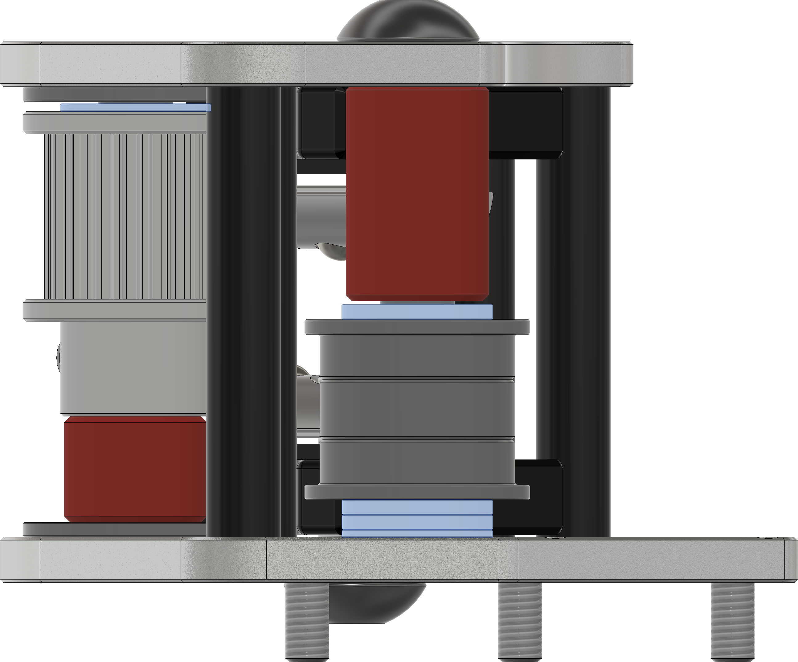
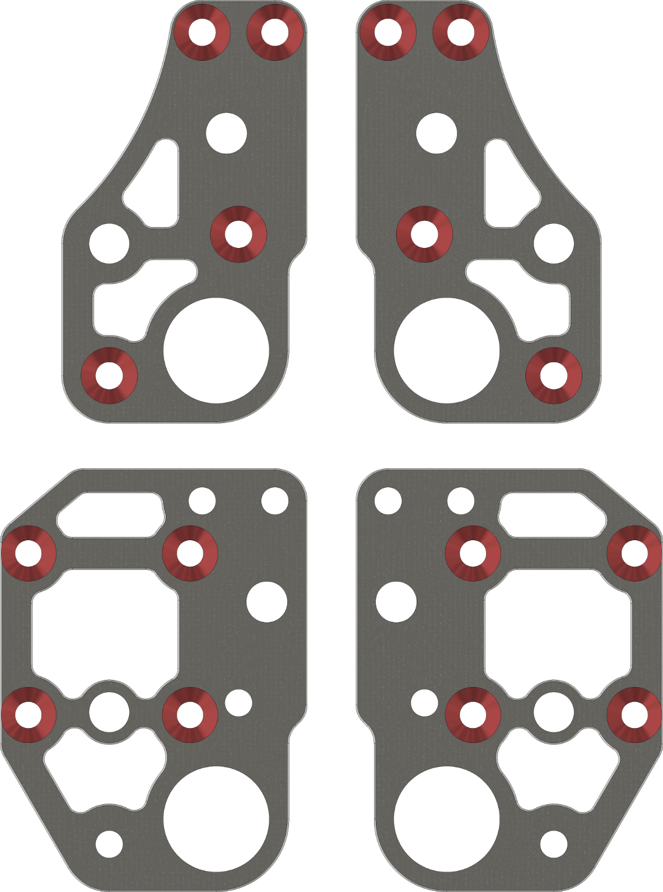
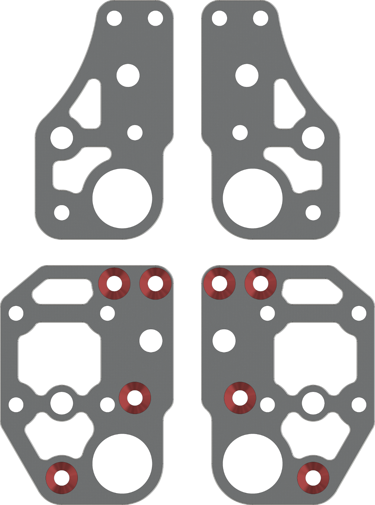

# 9mm Imperial Xjoints

___

**Top Mount Xjoints** are for toolheads designed around the stock Zerog Mercury one.1 belt path. (Zerog EVA 2.4, E34M1, VZCNC Zerog) I am not aware of any mods to support 9mm belts for these toolhead options currently.

**Front Mount** for any toolhead made for a front mounted MGN12 rail. (Voron Stealth Burner, XOL, Archtype, ect.)

**Live idlers:** 9mm Xjoints are designed for a live idler setup, which will require modifying a 20t pulley by removing the hub. 4 pulleys are listed, as it is recommended to use the flanges off another set in place of the hub. You will also need to file/grind the set screws down, as they will hit the upper belt. Watch this Youtube Video on pulling the Hub <https://youtu.be/RKpxDKYOJYs?si=vfwZNFjSuAocWLpN>

Cad is currently only designed around Gates pulleys, other pulleys are not as tall and will require more shims. I will add more printed inserts and recommended shim stacks for other idlers later.
___

**Tools Needed:**

- Drill press
- 90 degree Countersinking bit (82 degree also works)
- 220 grit sandpaper (For sanding dowel pins to fit into the bearings)
- Cordless drill (Use with a spare dowel pin to ream the dowel pin holes to size as needed)
- Pulley Hub puller (I will model one when I have time, there is a user created one pinned in the zerog Discord in the metal gantry mod thread)
- Blue medium strength thread locker

___

Bearing flange stacks and Idler spacer image

- Flange stacks use 2x M5x1 shims and 1x M5x0.5mm shim on the plate side, and a single M5x0.5mm shim on the side with the printed spacer.
- Live idler uses a single M5x0.5mm shim between the bearing and pulley.

Countersink the holes marked in red. Marking them in advanced with a sharpie can help prevent countersinking the wrong holes.

___

## DXF Plate BOM

| Part Description                       | Quantity |
|----------------------------------------|----------|
| Xjoint Bottom_x2.dxf                   | 2        |
| Xjoint Top_x2.dxf                      | 2        |

## 9mm Imperial Xjoint Hardware BOM

| Part Description               | Quantity |
|--------------------------------|----------|
| M3x30 standoffs                | 8        |
| 5x36mm Dowel Pins (Or 5x35)    | 4        |
| 9mm 20t 5mm Bore GT2 Pulley    | 4        |
| *F695RS Bearing                | 4        |
| 695RS Bearing                  | 2        |
| M3x6 FHCS                      | 8        |
| M3x10 FHCS                     | 16       |
| M5x14 BHCS                     | 4        |
| M5x1 Shim                      | 10       |
| M5x0.5 Shim                    | 4        |
| **M5x0.1 Shim                  | 4        |

*Included in default Mercury One.1 BOM

**Optional parts
