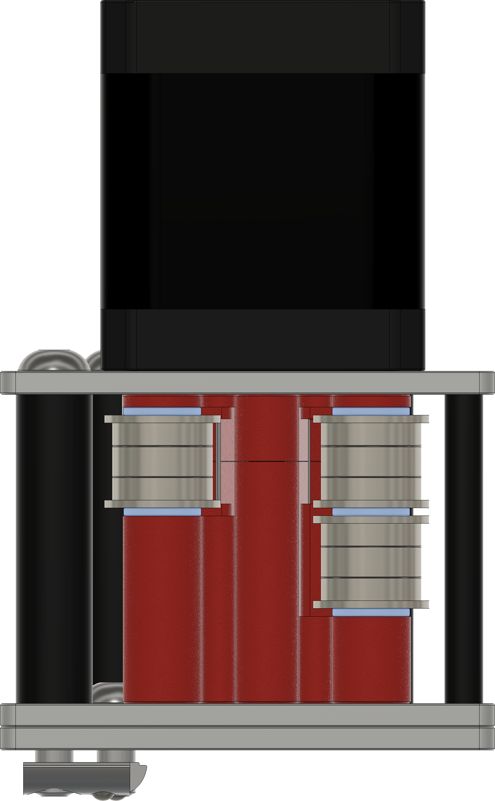
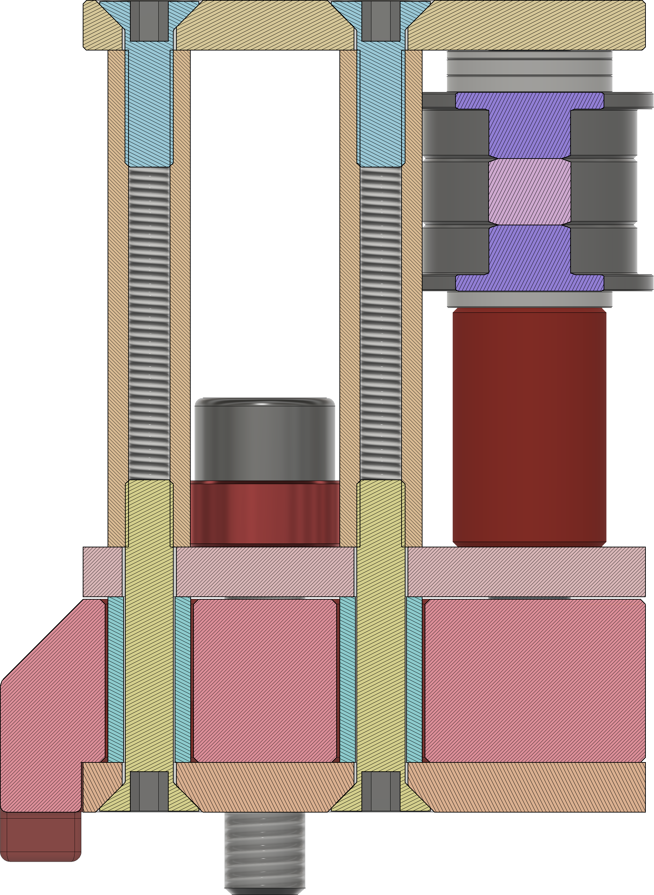

# 9mm Full Metal Gantry

___

Stepper Flange Stack assembly:
5x1mm shims as shown in the image below, using F695 and 695 bearings.

M3 washers might be needed with the stepper screws to prevent them from bottoming out in the threads.

Metric plates (3mm thick plates) will require M5x1 shims under the M5 bolts to prevent the threads from bottoming out against the extrusion

  
  

___

## 9mm Xjoints

**NOTE:** Make Sure you remove the hub on the pulley, it will interfere with the belt. You will also need to grind the set screws down, or source shorter ones. The set screws are M4 thread.

For the flange stack use 2x M5x1 shims and 1x M5x0.5 shim on the side against the plate, and a single M5x1 shim on the side with the printed spacer. You can tighten up the fit with M5x0.1mm shims.

With the live Idler setup if using a gates pulley, a M5x0.3mm shim is needed between the pulley and bearing. You can use smaller shims to tighten up the play between the printed spacer and bearing.

___

## 9mm Front Towers

For the flange stack use 2x M5x1 shims and 1x M5x0.5 shim on the side against the plate, and a single M5x1 shim on the side with the printed spacer. You can tighten up the fit with M5x0.1mm shims.

The M5 bolt needs a M5x3(Imperial) or M5x4(Metric) spacer under the bolt head, shims or washers can also be used in place of a single spacer.

Make sure to press in the 4 M3x10 smooth spacers inside the printed insert. These should be as tall or taller than the print itself. If your print is taller, file or sand the top of it until the inserts are flush or slightly taller thant the print.

___

### 9mm Hardware BOM

| Part Description                 | Quantity |
|----------------------------------|----------|
| M3x30 standoffs                  | 16       |
| M3x40 standoffs                  | 6        |
| M3x5x10 spacers                  | 8        |
| M5x40 Spacers                    | 4        |
| M5x3 Spacers (Imperial)          | 2        |
| M5x4 Spacers (Metric)            | 2        |
| 5x36mm Dowel Pins (Or 5x35)      | 4        |
| 5x40mm Dowel Pins                | 2        |
| 5x45mm Dowel Pins                | 4        |
| 9mm 20t 5mm Bore GT2 Pulley      | 6        |
| 695RS Bearing                    | 10       |
| *F695RS Bearing                  | 20       |
| M3x6 FHCS                        | 8        |
| M3x10 FHCS                       | 36       |
| M3x12 FHCS                       | 14       |
| M3x20 FHCS                       | 8        |
| M5x14 BHCS                       | 4        |
| M5x12 BHCS                       | 3        |
| M5x25 SHCS/BHCS                  | 2        |
| M5x55 BHCS                       | 5        |
| M3 Heatsets                      | 8        |
| M5x1 Shim                        | 30       |
| M5x0.5 Shim                      | 10       |
| M5x0.3 Shim                      | 10       |
| **M5x0.1 Shim                    | 10       |

*Included in default Mercury One.1 BOM

**Optional parts

### DXF Laser Cut Plates BOM

| Part Description                       | Quantity |
|----------------------------------------|----------|
| Stepper Top-Center Plate_x4.dxf        | 4        |
| Stepper Bottom Plate_x2.dxf            | 2        |
| Xjoint Bottom_x2.dxf                   | 2        |
| Xjoint Top_x2.dxf                      | 2        |
| Front Idler Towers_x6.dxf              | 6        |

### Printed Parts BOM

| Part Description                        | Quantity |
|-----------------------------------------|----------|
| 9mm - Printed Bottom Left Insert.stl    | 1        |
| 9mm - Printed Bottom Right Insert.stl   | 1        |
| 9mm - Printed Top Left Insert.stl       | 1        |
| 9mm - Printed Top Right Insert.stl      | 1        |
| 9mm Live Idler Spacer_x2.stl            | 2        |
| 9mm Xjoint Tall Spacer_x2.stl           | 2        |
| 9mm Xjoint Spacer Bottom_x2.stl         | 2        |
| 9mm Xjoint Spacer Top_x2.stl            | 2        |
| 9mm Front Tower Spacer_x2.stl           | 2        |
| Front Tower Heatset Spacer_x2.stl       | 2        |
