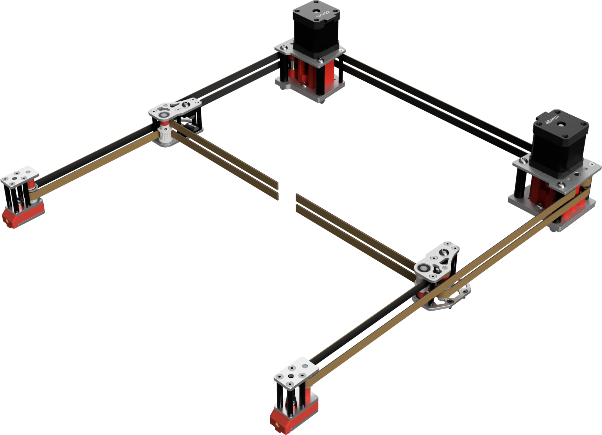
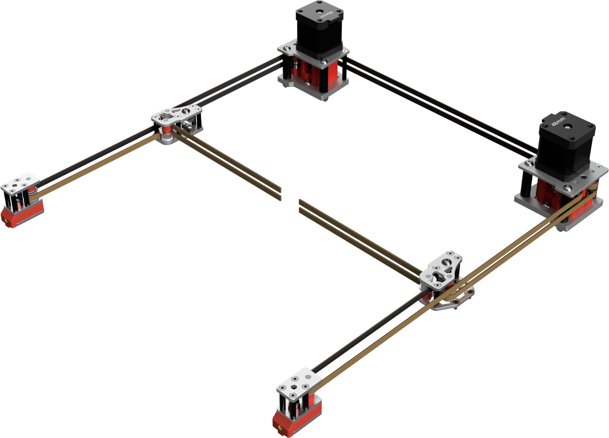

# Mercury One.1 - Full Metal Gantry

___

 These are a self source design using laser cut aluminum plates from vendors like sendcutsend. The entire belt path and gantry has been moved lower than the stock printed parts. You cannot mix and match these parts with stock printed stepper mounts, xjoints, or front towers. If you already have my metal stepper mounts, you can still use the same metal plates and upgrade to the full metal gantry.

**Assembly steps will be added later, for now you will have to reference the CAD.**
___

**Imperial files:**

- Mainly for those sourcing material in North America
- Files are designed 1/8 inch thick plate (.125in or 3.175mm)

**Metric files:**

- Files are designed for 3mm thick plate (.118in)
- You will also need to use M5 washers under the M5 bolts in the stepper towers to prevent the bolts from bottoming out on the extrusion.

**Other Notes:**

- Top Mount for toolheads designed around the stock Zerog Mercury one.1 belt path.
- Front Mount for any toolhead made for a front mounted MGN12 rail.
- Stepper Tower printed insert pairs should measure slightly less than the height of the aluminum spacers used. If your pairs are 0.2-0.4mm short, you can use the offset files to reduce the gap.
- 9mm Xjoints are designed for a live idler setup, which will require modifying a 20t pulley by removing the hub.
- Youtube Video on pulling the Hub <https://youtu.be/RKpxDKYOJYs?si=vfwZNFjSuAocWLpN>

___

## 9mm Full Metal Gantry With Live Idler

 

## 6mm Full Metal Gantry

  

## DXF Plate BOM

| Part Description                       | Quantity |
|----------------------------------------|----------|
| Stepper Top-Center Plate_x4.dxf        | 4        |
| Stepper Bottom Plate_x2.dxf            | 2        |
| Xjoint Bottom_x2.dxf                   | 2        |
| Xjoint Top_x2.dxf                      | 2        |
| Front Idler Towers_x6.dxf              | 6        |

## 6mm Full Metal Gantry Hardware BOM

| Part Description               | Quantity |
|--------------------------------|----------|
| M3x20 standoffs                | 16       |
| M3x35 standoffs                | 6        |
| M5x35 Spacers                  | 4        |
| M5x3 Spacers (Imperial)        | 2        |
| M5x4 Spacers (Metric)          | 2        |
| 5x26mm Dowel Pins              | 4        |
| 5x30mm Dowel Pins              | 2        |
| 5x40mm Dowel Pins              | 4        |
| *6mm 20t 5mm Bore GT2 Pulley   | 2        |
| *6mm 20t 5mm Bore GT2 Idler    | 2        |
| *F695RS Bearing                | 20       |
| M3x6 FHCS                      | 8        |
| M3x10 FHCS                     | 36       |
| M3x12 FHCS                     | 14       |
| M3x20 FHCS                     | 8        |
| M5x8 BHCS                      | 4        |
| M5x12 BHCS                     | 3        |
| M5x25 SHCS/BHCS                | 2        |
| M5x50 BHCS                     | 5        |
| M3 Heatsets                    | 8        |
| M5x1 Shim                      | 20       |
| M5x0.5 Shim                    | 10       |
| M5x0.3 Shim                    | 10       |
| **M5x0.1 Shim                  | 10       |

*Included in defauly Mercury One.1 BOM

**Optional parts

## 9mm Full Metal Gantry Hardware BOM

| Part Description               | Quantity |
|--------------------------------|----------|
| M3x30 standoffs                | 16       |
| M3x40 standoffs                | 6        |
| M5x40 Spacers                  | 4        |
| M5x3 Spacers (Imperial)        | 2        |
| M5x4 Spacers (Metric)          | 2        |
| 5x36mm Dowel Pins              | 4        |
| 5x40mm Dowel Pins              | 2        |
| 5x45mm Dowel Pins              | 4        |
| 9mm 20t 5mm Bore GT2 Pulley    | 6        |
| 695RS Bearing                  | 10       |
| *F695RS Bearing                | 20       |
| M3x6 FHCS                      | 8        |
| M3x10 FHCS                     | 36       |
| M3x12 FHCS                     | 14       |
| M3x20 FHCS                     | 8        |
| M5x14 BHCS                     | 4        |
| M5x12 BHCS                     | 3        |
| M5x25 SHCS/BHCS                | 2        |
| M5x55 BHCS                     | 5        |
| M3 Heatsets                    | 8        |
| M5x1 Shim                      | 30       |
| M5x0.5 Shim                    | 10       |
| M5x0.3 Shim                    | 10       |
| **x0.1 Shim                    | 10       |

*Included in defauly Mercury One.1 BOM

**Optional parts
