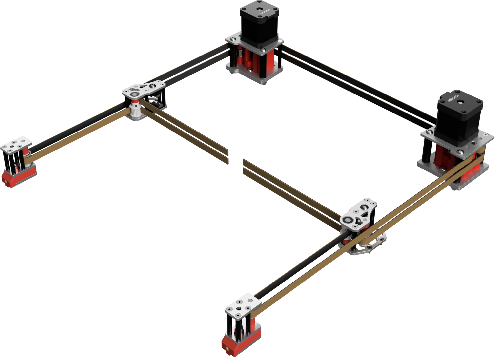
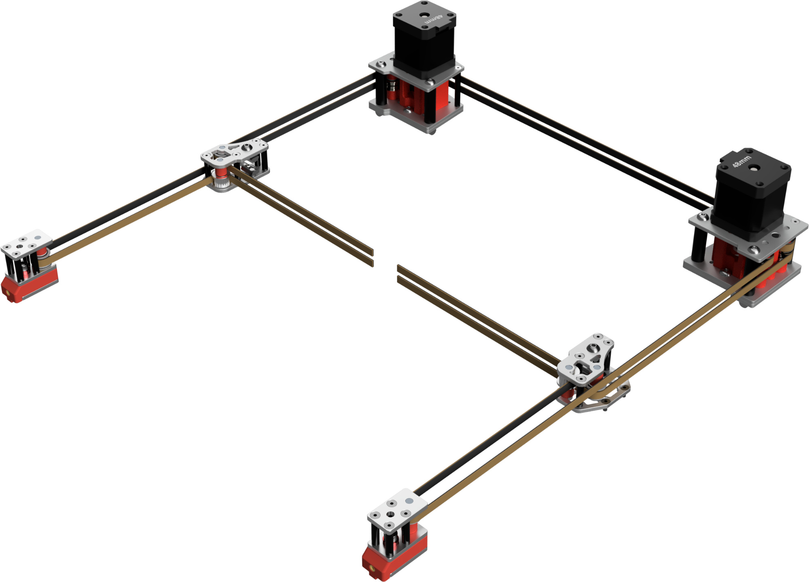

# Mercury One.1 - Full Metal Gantry

___

 These are a self source design using laser cut aluminum plates from vendors like SendCutSend. The entire belt path and gantry has been moved lower than the stock printed parts. You cannot mix and match these parts with stock printed stepper mounts, xjoints, or front towers. If you already have my metal stepper mounts, you can still use the same metal plates and upgrade to the full metal gantry.

**Assembly steps will be added later, for now you will have to reference the CAD.**
___

**Imperial files:**

- Mainly for those sourcing material in North America
- Files are designed 1/8 inch thick plate (.125in or 3.175mm)

**Metric files:**

- Files are designed for 3mm thick plate (.118in)
- You will also need to use M5 washers under the M5 bolts in the stepper towers to prevent the bolts from bottoming out on the extrusion.

**Other Notes:**

- Top Mount for toolheads designed around the stock Zerog Mercury one.1 belt path.
- Front Mount for any toolhead made for a front mounted MGN12 rail.
- Stepper Tower printed insert pairs should measure slightly less than the height of the aluminum spacers used. If your pairs are 0.2-0.4mm short, you can use the offset files to reduce the gap.
- 9mm Xjoints are designed for a live idler setup, which will require modifying a 20t pulley by removing the hub.
- Youtube Video on pulling the Hub <https://youtu.be/RKpxDKYOJYs?si=vfwZNFjSuAocWLpN>

**Tools Needed:**

- Drill press
- 90 degree Countersinking bit (82 degree also works)
- 220 grit sandpaper (For sanding dowel pins to fit into the bearings)
- Cordless drill (Use with a spare dowel pin to ream the dowel pin holes to size as needed)

___

## 9mm Full Metal Gantry With Live Idler

 

___

## 6mm Full Metal Gantry

  

___

## Sourcing

Laser cutting services:

- Sendcutsend <https://sendcutsend.com/>
- Laserboost <https://www.laserboost.com/>

Aluminum Spacers and Standoffs:

- D5xM3 Length 10mm <https://www.aliexpress.us/item/3256805776299657.html>
- M5 Length 3mm or 4mm <https://www.aliexpress.us/item/3256802832337103.html>
- 5mmx8mm 35/40mm Spacers <https://www.aliexpress.us/item/3256805365722139.html>
- M3 Threaded spacers <https://www.aliexpress.us/item/2251832625574286.html>
- 5x26mm Dowel Pins <https://www.aliexpress.us/item/3256803593912582.html>
- 5x36mm 5x26mm Dowel Pins <https://www.aliexpress.us/item/2251832864425146.html>
- M5 shims <https://www.aliexpress.us/item/3256801130894631.html>

___
